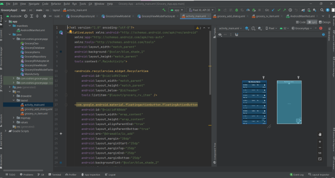

<h1>The grocery app</h1>
The grocery app is developed for Android using Android Studio. Because we can't remember everything, we frequently forget to buy the things we want to buy. However, with the aid of this app, you may make a list of the groceries you intend to buy so that you don't forget anything. Kotlin was used to implement this project.

Coroutines, Model View ViewModel (MVVM) architectural patterns, Room for the database, and RecyclerView to display the list of objects are all used in this project.

LiveData
 A class that holds observable data. The latest version of the data is always held or cached, and it alerts observers when the data has changed. LiveData is aware of the lifespan. UI elements don't pause or resume observation; they only keep an eye on the relevant data. Since LiveData is aware of the relevant lifecycle status changes while monitoring, it handles all of this automatically.

ViewModel: Serves as a conduit for information between the UI and the Repository (data). The source of the data is no longer a concern for the UI. ViewModel instances are preserved during Activity/Fragment playback.

MVVM (Model View ViewModel):Android uses MVVM architecture to arrange project code and make it simpler to understand. An architectural design pattern used in Android is MVVM. XML files and Activity classes are treated as Views by MVVM. With this design approach, UI and logic are entirely separated. Here is a visual representation of MVVM.

DataBase ROOM: The data of apps, such as the name, amount, and price of groceries, are stored in the Room persistence library, a database management library. Room is a cover layer for SQLite that makes it easier to operate on databases.

RecycleView: RecyclerView is a container that is used to show a collection of data in a sizable data set that can be scrolled efficiently by keeping the number of views to a minimum.
Coroutines

Since coroutines are lightweight threads, we utilise them to execute operations on other threads so that our app doesn't crash or cause our main thread to halt.

Entity: Annotated classthat describes a database table when workingwith Room.

SQLite database: On device storage. The Room persistence library creates and maintains this database for you.

DAO: Data access object.A mapping of SQL queriesto functions. When you use a DAO,you call the methods, and Room takes care of the rest.

<h3><b>Output</b></h3>

<h3><b>Demo link</b></h3>
https://drive.google.com/file/d/1tWAHzdpk3nEu9mgZtr8yjqa7odM16qhx/view?usp=sharing
